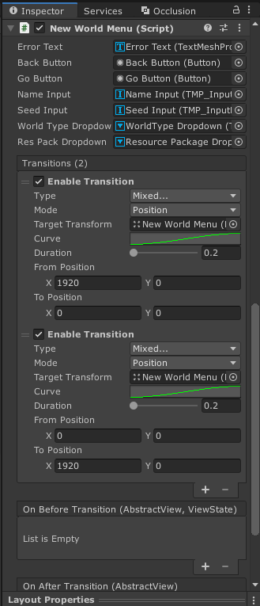

# Toaru Unity no UI

* 版本：**0.3.7-preview**

* 目前由于时间原因，只能简单写一个README
* 该项目中的代码尚未经过完整测试
* 为了防止代码过于臃肿，目前过时的API将直接被移除，版本变更为正式版后，将采用Obsolete标记过时API

## 示例代码：

> 代码截取自我的另一个MinecraftClone项目



``` c#
using ToaruUnity.UI;

namespace Minecraft.UI
{
    internal sealed class NewWorldMenuActionState : IActionState
    {
        public ValueObserved<string[]> ResPackNames = new ValueObserved<string[]>();
        public ValueObserved<string> ErrorText = new ValueObserved<string>(true);
    }
}
```

``` c#
using System.Collections;
using System.Collections.Generic;
using TMPro;
using ToaruUnity.UI;
using UnityEngine;
using UnityEngine.UI;

#pragma warning disable CS0649

namespace Minecraft.UI
{
    [InjectActions(typeof(NewWorldMenuActions))]
    public sealed class NewWorldMenu : TweenUGUIView
    {
        [SerializeField] private TextMeshProUGUI m_ErrorText;
        [SerializeField] private Button m_BackButton;
        [SerializeField] private Button m_GoButton;
        [SerializeField] private TMP_InputField m_NameInput;
        [SerializeField] private TMP_InputField m_SeedInput;
        [SerializeField] private TMP_Dropdown m_WorldTypeDropdown;
        [SerializeField] private TMP_Dropdown m_ResPackDropdown;


        protected override void OnCreate()
        {
            base.OnCreate();

            m_BackButton.onClick.AddListener(() => Actions.Execute("Close"));
            m_GoButton.onClick.AddListener(() => Actions.Execute("Create World",
                m_NameInput.text,
                m_SeedInput.text,
                m_WorldTypeDropdown.captionText.text,
                m_ResPackDropdown.captionText.text
            ));
        }
        
        protected override IEnumerator OnOpen(object param)
        {
            Actions.Execute("Load ResPack");
            return base.OnOpen(param);
        }

        protected override void OnRefreshView(IActionState state)
        {
            NewWorldMenuActionState s = state as NewWorldMenuActionState;

            if (s.ErrorText.ApplyChanges())
            {
                m_ErrorText.text = s.ErrorText;
            }

            if (s.ResPackNames.ApplyChanges())
            {
                string[] names = s.ResPackNames;
                List<TMP_Dropdown.OptionData> options = m_ResPackDropdown.options;
                options.Clear();

                for (int i = 0; i < names.Length; i++)
                {
                    options.Add(new TMP_Dropdown.OptionData(names[i]));
                }

                m_ResPackDropdown.RefreshShownValue();
            }
        }
    } 
}
```

``` c#
using System;
using System.Collections.Generic;
using System.Diagnostics;
using System.IO;
using ToaruUnity.UI;
using UnityEngine;
using UnityEngine.SceneManagement;

namespace Minecraft.UI
{
    internal sealed class NewWorldMenuActions : ActionCenter
    {
        protected override IActionState CreateState()
        {
            return new NewWorldMenuActionState();
        }

        protected override void ResetState(ref IActionState state)
        {
            NewWorldMenuActionState s = state as NewWorldMenuActionState;
            s.ResPackNames.Value = default;
            s.ErrorText.Value = default;
        }


        [Action]
        public bool Close()
        {
            Manager.CloseActiveView(out _, default);
            return false;
        }

        [Action("Create World")]
        public bool CreateWorld(string name, string s, string type, string resPackName)
        {
            NewWorldMenuActionState state = GetState<NewWorldMenuActionState>();

            if (string.IsNullOrEmpty(name))
            {
                state.ErrorText.Value = "invalid world name";
                return true;
            }

            string folder = Application.dataPath + "/Worlds/" + name;

            if (Directory.Exists(folder))
            {
                state.ErrorText.Value = "world has already existed";
                return true;
            }

            if (!int.TryParse(s, out int seed))
            {
                seed = string.IsNullOrEmpty(s) ? (Process.GetCurrentProcess().Id + DateTime.Now.GetHashCode()) : s.GetHashCode();
            }

            WorldType worldType;

            switch (type)
            {
                case "Endless":
                    worldType = WorldType.Normal;
                    break;
                case "Plain":
                    worldType = WorldType.Plain;
                    break;
                case "Old":
                    worldType = WorldType.Fixed;
                    break;
                default:
                    state.ErrorText.Value = "invalid world type";
                    return true;
            }

            if (string.IsNullOrEmpty(resPackName))
            {
                resPackName = WorldConsts.DefaultResourcePackageName;
            }

            WorldSettings.Active = new WorldSettings
            {
                Name = name,
                Type = worldType,
                Mode = PlayMode.Creative,
                Seed = seed,
                Position = Vector3.down,
                BodyRotation = Quaternion.identity,
                CameraRotation = Quaternion.identity,
                ResourcePackageName = resPackName
            };

            LoadingUtility.LoadSceneAsync(1);
            return false;
        }

        [Action("Load ResPack")]
        public IEnumerator<bool> LoadResPack()
        {
            string path = Path.Combine(Application.streamingAssetsPath, WorldConsts.ResourcePackagesFolderName);
            string[] packs = Directory.GetDirectories(path);
            yield return false;

            string[] names = new string[packs.Length];

            for (int i = 0; i < packs.Length; i++)
            {
                names[i] = Path.GetFileNameWithoutExtension(packs[i]);
            }

            GetState<NewWorldMenuActionState>().ResPackNames.Value = names;
            yield return true;
        }
    }
}
```

