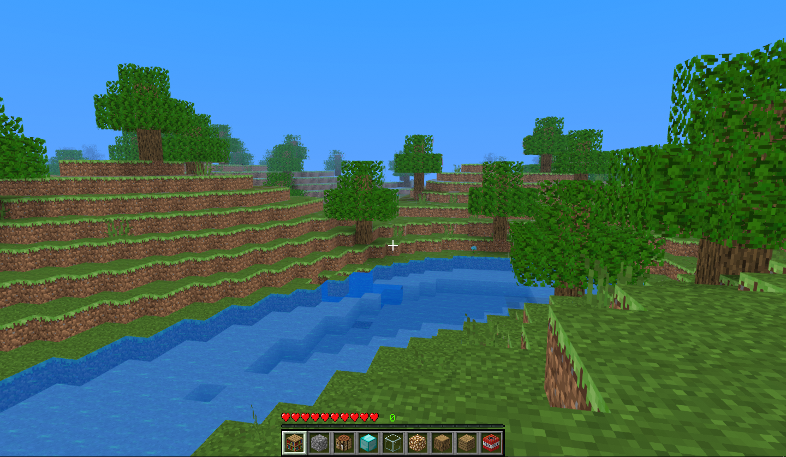
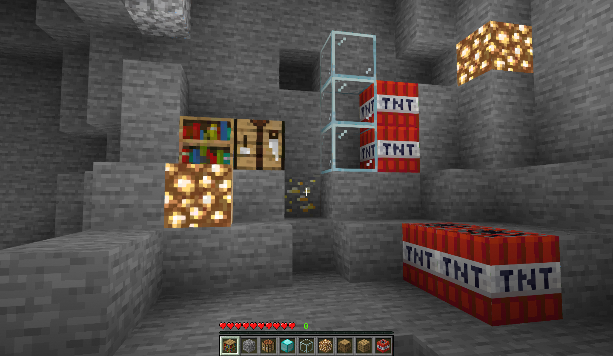
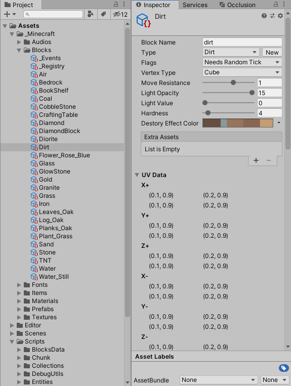
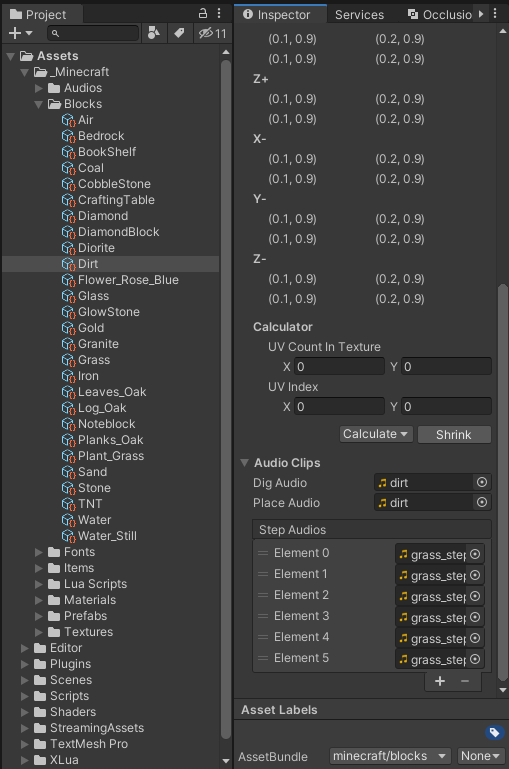
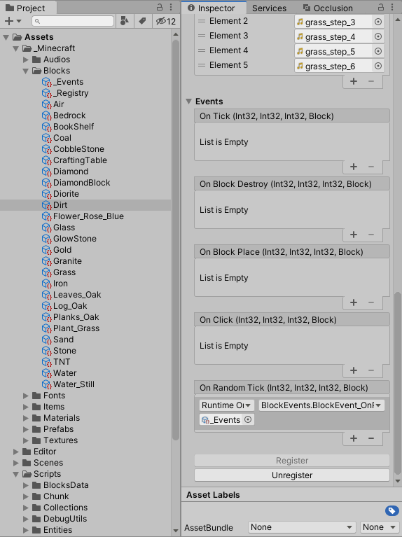
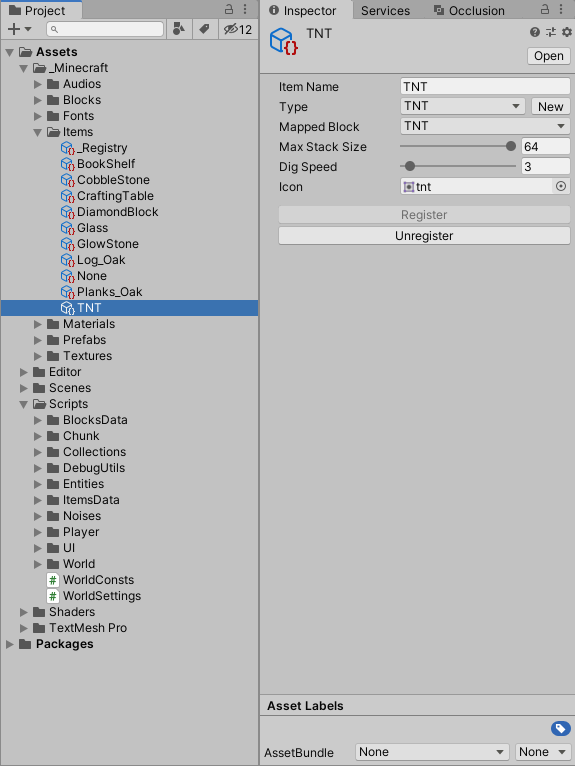

# 使用Unity制作的Minecraft

## 特性

* 无限地形生成
* 洞穴和矿物
* 光照与物理
* 能爆炸的TNT
* 能流动的水
* 受重力影响的沙子
* 世界会被保存到文件中
* 音效和粒子特效
* 一些bug (〃'▽'〃)

## Unity中的方块编辑器和物品编辑器

你可以不写一行代码创建一个新的方块或物品！一些复杂方块的逻辑只需要写在对应的事件中。

## 修改世界的配置

进入`C:\Users\${你的用户名}\AppData\LocalLow\JinYuhan\MinecraftClone\Worlds`路径，打开以要修改的世界的名称命名的文件夹，找到`settings.json`，双击打开编辑。

| 字段                    | 类型                  | 用途                                                         |
| ----------------------- | --------------------- | ------------------------------------------------------------ |
| `Name`                  | `System.String`       | 世界的名称                                                   |
| `Type`                  | `System.Int32`        | 世界的类型（暂时保留）                                       |
| `Mode`                  | `System.Byte`         | 世界的玩法（暂时保留）                                       |
| `Seed`                  | `System.Int32`        | 世界的种子                                                   |
| `RenderChunkRadius`     | `System.Int32`        | 渲染区块的半径（半径以内的区块才会被渲染）                   |
| `HorizontalFOVInDEG`    | `System.Single`       | 水平视角大小（角度制）                                       |
| `MaxChunkCountInMemory` | `System.Int32`        | 内存中最多保留的区块数量，超出这个数字后，将开始卸载部分区块 |
| `EnableDestroyEffect`   | `System.Boolean`      | 是否显示摧毁方块的特效                                       |
| `Position`              | `UnityEngine.Vector3` | 玩家上一次结束游戏时的坐标                                   |

## 参考

**排名不分先后**

1. [TrueCraft](https://github.com/ddevault/TrueCraft)
2. [MineClone-Unity](https://github.com/bodhid/MineClone-Unity)
3. [MinecraftClone](https://github.com/Shedelbower/MinecraftClone)
4. [Making a Minecraft Clone](https://www.shedelbower.dev/projects/minecraft_clone/)
5. [Minecraft_Wiki](https://minecraft-zh.gamepedia.com/Minecraft_Wiki)
6. [炒鸡嗨客协管徐的CSDN博客](https://blog.csdn.net/xfgryujk)

## 更新

[2020-08-19](CHANGE_LOG-2020-08-19.md)